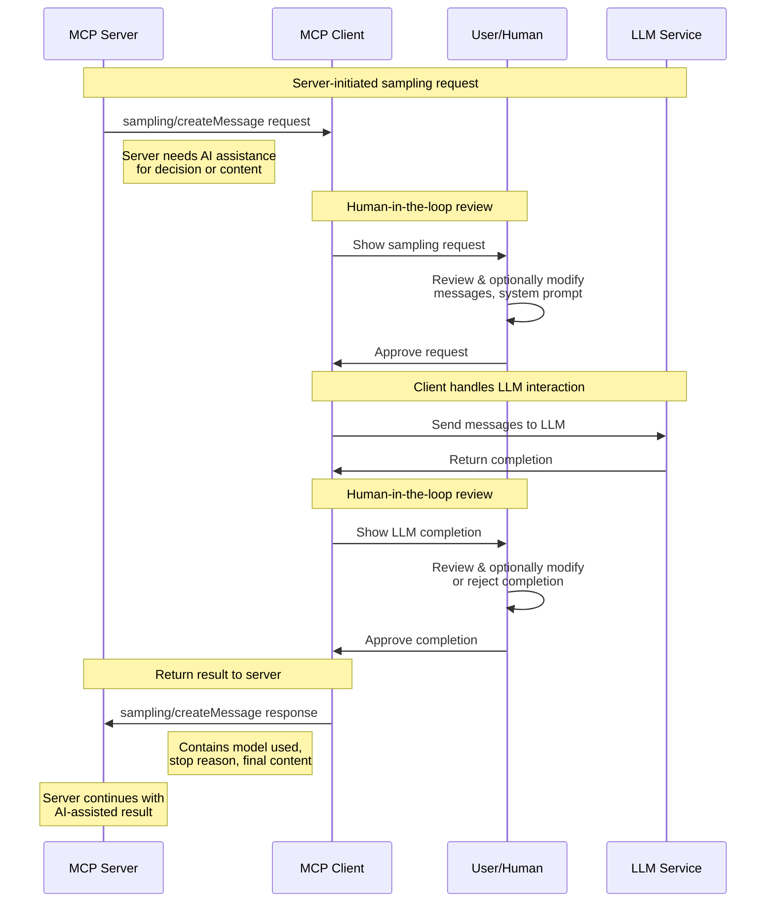

# MCP Swift SDK

Official Swift SDK for the [Model Context Protocol][mcp] (MCP).

## Overview

The Model Context Protocol (MCP) defines a standardized way
for applications to communicate with AI and ML models.
This Swift SDK implements both client and server components
according to the [2025-03-26][mcp-spec-2025-03-26] (latest) version 
of the MCP specification.

## Requirements

- Swift 6.0+ (Xcode 16+)

See the [Platform Availability](#platform-availability) section below
for platform-specific requirements.

## Installation

### Swift Package Manager

Add the following to your `Package.swift` file:

```swift
dependencies: [
    .package(url: "https://github.com/modelcontextprotocol/swift-sdk.git", from: "0.10.0")
]
```

Then add the dependency to your target:

```swift
.target(
    name: "YourTarget",
    dependencies: [
        .product(name: "MCP", package: "swift-sdk")
    ]
)
```

## Client Usage

The client component allows your application to connect to MCP servers.

### Basic Client Setup

```swift
import MCP

// Initialize the client
let client = Client(name: "MyApp", version: "1.0.0")

// Create a transport and connect
let transport = StdioTransport()
let result = try await client.connect(transport: transport)

// Check server capabilities
if result.capabilities.tools != nil {
    // Server supports tools (implicitly including tool calling if the 'tools' capability object is present)
}
```

> [!NOTE]
> The `Client.connect(transport:)` method returns the initialization result.
> This return value is discardable, 
> so you can ignore it if you don't need to check server capabilities.

### Transport Options for Clients

#### Stdio Transport

For local subprocess communication:

```swift
// Create a stdio transport (simplest option)
let transport = StdioTransport()
try await client.connect(transport: transport)
```

#### HTTP Transport

For remote server communication:

```swift
// Create a streaming HTTP transport
let transport = HTTPClientTransport(
    endpoint: URL(string: "http://localhost:8080")!,
    streaming: true  // Enable Server-Sent Events for real-time updates
)
try await client.connect(transport: transport)
```

### Tools

Tools represent functions that can be called by the client:

```swift
// List available tools
let (tools, cursor) = try await client.listTools()
print("Available tools: \(tools.map { $0.name }.joined(separator: ", "))")

// Call a tool with arguments
let (content, isError) = try await client.callTool(
    name: "image-generator",
    arguments: [
        "prompt": "A serene mountain landscape at sunset",
        "style": "photorealistic",
        "width": 1024,
        "height": 768
    ]
)

// Handle tool content
for item in content {
    switch item {
    case .text(let text):
        print("Generated text: \(text)")
    case .image(let data, let mimeType, let metadata):
        if let width = metadata?["width"] as? Int,
           let height = metadata?["height"] as? Int {
            print("Generated \(width)x\(height) image of type \(mimeType)")
            // Save or display the image data
        }
    case .audio(let data, let mimeType):
        print("Received audio data of type \(mimeType)")
    case .resource(let uri, let mimeType, let text):
        print("Received resource from \(uri) of type \(mimeType)")
        if let text = text {
            print("Resource text: \(text)")
        }
    }
}
```

### Resources

Resources represent data that can be accessed and potentially subscribed to:

```swift
// List available resources
let (resources, nextCursor) = try await client.listResources()
print("Available resources: \(resources.map { $0.uri }.joined(separator: ", "))")

// Read a resource
let contents = try await client.readResource(uri: "resource://example")
print("Resource content: \(contents)")

// Subscribe to resource updates if supported
if result.capabilities.resources.subscribe {
    try await client.subscribeToResource(uri: "resource://example")

    // Register notification handler
    await client.onNotification(ResourceUpdatedNotification.self) { message in
        let uri = message.params.uri
        print("Resource \(uri) updated with new content")

        // Fetch the updated resource content
        let updatedContents = try await client.readResource(uri: uri)
        print("Updated resource content received")
    }
}
```

### Prompts

Prompts represent templated conversation starters:

```swift
// List available prompts
let (prompts, nextCursor) = try await client.listPrompts()
print("Available prompts: \(prompts.map { $0.name }.joined(separator: ", "))")

// Get a prompt with arguments
let (description, messages) = try await client.getPrompt(
    name: "customer-service",
    arguments: [
        "customerName": "Alice",
        "orderNumber": "ORD-12345",
        "issue": "delivery delay"
    ]
)

// Use the prompt messages in your application
print("Prompt description: \(description)")
for message in messages {
    if case .text(text: let text) = message.content {
        print("\(message.role): \(text)")
    }
}
```

### Sampling

Sampling allows servers to request LLM completions through the client, 
enabling agentic behaviors while maintaining human-in-the-loop control. 
Clients register a handler to process incoming sampling requests from servers.

> [!TIP]
> Sampling requests flow from **server to client**, 
> not client to server. 
> This enables servers to request AI assistance 
> while clients maintain control over model access and user approval.

```swift
// Register a sampling handler in the client
await client.withSamplingHandler { parameters in
    // Review the sampling request (human-in-the-loop step 1)
    print("Server requests completion for: \(parameters.messages)")
    
    // Optionally modify the request based on user input
    var messages = parameters.messages
    if let systemPrompt = parameters.systemPrompt {
        print("System prompt: \(systemPrompt)")
    }
    
    // Sample from your LLM (this is where you'd call your AI service)
    let completion = try await callYourLLMService(
        messages: messages,
        maxTokens: parameters.maxTokens,
        temperature: parameters.temperature
    )
    
    // Review the completion (human-in-the-loop step 2)
    print("LLM generated: \(completion)")
    // User can approve, modify, or reject the completion here
    
    // Return the result to the server
    return CreateSamplingMessage.Result(
        model: "your-model-name",
        stopReason: .endTurn,
        role: .assistant,
        content: .text(completion)
    )
}
```

The sampling flow follows these steps:



This human-in-the-loop design ensures that users 
maintain control over what the LLM sees and generates, 
even when servers initiate the requests.

### Error Handling

Handle common client errors:

```swift
do {
    try await client.connect(transport: transport)
    // Success
} catch let error as MCPError {
    print("MCP Error: \(error.localizedDescription)")
} catch {
    print("Unexpected error: \(error)")
}
```

### Advanced Client Features

#### Strict vs Non-Strict Configuration

Configure client behavior for capability checking:

```swift
// Strict configuration - fail fast if a capability is missing
let strictClient = Client(
    name: "StrictClient",
    version: "1.0.0",
    configuration: .strict
)

// With strict configuration, calling a method for an unsupported capability
// will throw an error immediately without sending a request
do {
    // This will throw an error if resources.list capability is not available
    let resources = try await strictClient.listResources()
} catch let error as MCPError {
    print("Capability not available: \(error.localizedDescription)")
}

// Default (non-strict) configuration - attempt the request anyway
let client = Client(
    name: "FlexibleClient",
    version: "1.0.0",
    configuration: .default
)

// With default configuration, the client will attempt the request
// even if the capability wasn't advertised by the server
do {
    let resources = try await client.listResources()
} catch let error as MCPError {
    // Still handle the error if the server rejects the request
    print("Server rejected request: \(error.localizedDescription)")
}
```

#### Request Batching

Improve performance by sending multiple requests in a single batch:

```swift
// Array to hold tool call tasks
var toolTasks: [Task<CallTool.Result, Swift.Error>] = []

// Send a batch of requests
try await client.withBatch { batch in
    // Add multiple tool calls to the batch
    for i in 0..<10 {
        toolTasks.append(
            try await batch.addRequest(
                CallTool.request(.init(name: "square", arguments: ["n": Value(i)]))
            )
        )
    }
}

// Process results after the batch is sent
print("Processing \(toolTasks.count) tool results...")
for (index, task) in toolTasks.enumerated() {
    do {
        let result = try await task.value
        print("\(index): \(result.content)")
    } catch {
        print("\(index) failed: \(error)")
    }
}
```

You can also batch different types of requests:

```swift
// Declare task variables
var pingTask: Task<Ping.Result, Error>?
var promptTask: Task<GetPrompt.Result, Error>?

// Send a batch with different request types
try await client.withBatch { batch in
    pingTask = try await batch.addRequest(Ping.request())
    promptTask = try await batch.addRequest(
        GetPrompt.request(.init(name: "greeting"))
    )
}

// Process individual results
do {
    if let pingTask = pingTask {
        try await pingTask.value
        print("Ping successful")
    }

    if let promptTask = promptTask {
        let promptResult = try await promptTask.value
        print("Prompt: \(promptResult.description ?? "None")")
    }
} catch {
    print("Error processing batch results: \(error)")
}
```

> [!NOTE]
> `Server` automatically handles batch requests from MCP clients.

## Server Usage

The server component allows your application to host model capabilities and respond to client requests.

### Basic Server Setup

```swift
import MCP

// Create a server with given capabilities
let server = Server(
    name: "MyModelServer",
    version: "1.0.0",
    capabilities: .init(
        prompts: .init(listChanged: true),
        resources: .init(subscribe: true, listChanged: true),
        tools: .init(listChanged: true)
    )
)

// Create transport and start server
let transport = StdioTransport()
try await server.start(transport: transport)

// Now register handlers for the capabilities you've enabled
```

### Tools

Register tool handlers to respond to client tool calls:

```swift
// Register a tool list handler
await server.withMethodHandler(ListTools.self) { _ in
    let tools = [
        Tool(
            name: "weather",
            description: "Get current weather for a location",
            inputSchema: .object([
                "properties": .object([
                    "location": .string("City name or coordinates"),
                    "units": .string("Units of measurement, e.g., metric, imperial")
                ])
            ])
        ),
        Tool(
            name: "calculator",
            description: "Perform calculations",
            inputSchema: .object([
                "properties": .object([
                    "expression": .string("Mathematical expression to evaluate")
                ])
            ])
        )
    ]
    return .init(tools: tools)
}

// Register a tool call handler
await server.withMethodHandler(CallTool.self) { params in
    switch params.name {
    case "weather":
        let location = params.arguments?["location"]?.stringValue ?? "Unknown"
        let units = params.arguments?["units"]?.stringValue ?? "metric"
        let weatherData = getWeatherData(location: location, units: units) // Your implementation
        return .init(
            content: [.text("Weather for \(location): \(weatherData.temperature)°, \(weatherData.conditions)")],
            isError: false
        )

    case "calculator":
        if let expression = params.arguments?["expression"]?.stringValue {
            let result = evaluateExpression(expression) // Your implementation
            return .init(content: [.text("\(result)")], isError: false)
        } else {
            return .init(content: [.text("Missing expression parameter")], isError: true)
        }

    default:
        return .init(content: [.text("Unknown tool")], isError: true)
    }
}
```

### Resources

Implement resource handlers for data access:

```swift
// Register a resource list handler
await server.withMethodHandler(ListResources.self) { params in
    let resources = [
        Resource(
            name: "Knowledge Base Articles",
            uri: "resource://knowledge-base/articles",
            description: "Collection of support articles and documentation"
        ),
        Resource(
            name: "System Status",
            uri: "resource://system/status",
            description: "Current system operational status"
        )
    ]
    return .init(resources: resources, nextCursor: nil)
}

// Register a resource read handler
await server.withMethodHandler(ReadResource.self) { params in
    switch params.uri {
    case "resource://knowledge-base/articles":
        return .init(contents: [Resource.Content.text("# Knowledge Base\n\nThis is the content of the knowledge base...", uri: params.uri)])

    case "resource://system/status":
        let status = getCurrentSystemStatus() // Your implementation
        let statusJson = """
            {
                "status": "\(status.overall)",
                "components": {
                    "database": "\(status.database)",
                    "api": "\(status.api)",
                    "model": "\(status.model)"
                },
                "lastUpdated": "\(status.timestamp)"
            }
            """
        return .init(contents: [Resource.Content.text(statusJson, uri: params.uri, mimeType: "application/json")])

    default:
        throw MCPError.invalidParams("Unknown resource URI: \(params.uri)")
    }
}

// Register a resource subscribe handler
await server.withMethodHandler(ResourceSubscribe.self) { params in
    // Store subscription for later notifications.
    // Client identity for multi-client scenarios needs to be managed by the server application,
    // potentially using information from the initialize handshake if the server handles one client post-init.
    // addSubscription(clientID: /* some_client_identifier */, uri: params.uri)
    print("Client subscribed to \(params.uri). Server needs to implement logic to track this subscription.")
    return .init()
}
```

### Prompts

Implement prompt handlers:

```swift
// Register a prompt list handler
await server.withMethodHandler(ListPrompts.self) { params in
    let prompts = [
        Prompt(
            name: "interview",
            description: "Job interview conversation starter",
            arguments: [
                .init(name: "position", description: "Job position", required: true),
                .init(name: "company", description: "Company name", required: true),
                .init(name: "interviewee", description: "Candidate name")
            ]
        ),
        Prompt(
            name: "customer-support",
            description: "Customer support conversation starter",
            arguments: [
                .init(name: "issue", description: "Customer issue", required: true),
                .init(name: "product", description: "Product name", required: true)
            ]
        )
    ]
    return .init(prompts: prompts, nextCursor: nil)
}

// Register a prompt get handler
await server.withMethodHandler(GetPrompt.self) { params in
    switch params.name {
    case "interview":
        let position = params.arguments?["position"]?.stringValue ?? "Software Engineer"
        let company = params.arguments?["company"]?.stringValue ?? "Acme Corp"
        let interviewee = params.arguments?["interviewee"]?.stringValue ?? "Candidate"

        let description = "Job interview for \(position) position at \(company)"
        let messages: [Prompt.Message] = [
            .user("You are an interviewer for the \(position) position at \(company)."),
            .user("Hello, I'm \(interviewee) and I'm here for the \(position) interview."),
            .assistant("Hi \(interviewee), welcome to \(company)! I'd like to start by asking about your background and experience.")
        ]

        return .init(description: description, messages: messages)

    case "customer-support":
        // Similar implementation for customer support prompt

    default:
        throw MCPError.invalidParams("Unknown prompt name: \(params.name)")
    }
}
```

### Sampling

Servers can request LLM completions from clients through sampling. This enables agentic behaviors where servers can ask for AI assistance while maintaining human oversight.

> [!NOTE]
> The current implementation provides the correct API design for sampling, but requires bidirectional communication support in the transport layer. This feature will be fully functional when bidirectional transport support is added.

```swift
// Enable sampling capability in server
let server = Server(
    name: "MyModelServer",
    version: "1.0.0",
    capabilities: .init(
        sampling: .init(),  // Enable sampling capability
        tools: .init(listChanged: true)
    )
)

// Request sampling from the client (conceptual - requires bidirectional transport)
do {
    let result = try await server.requestSampling(
        messages: [
            .user("Analyze this data and suggest next steps")
        ],
        systemPrompt: "You are a helpful data analyst",
        temperature: 0.7,
        maxTokens: 150
    )
    
    // Use the LLM completion in your server logic
    print("LLM suggested: \(result.content)")
    
} catch {
    print("Sampling request failed: \(error)")
}
```

Sampling enables powerful agentic workflows:
- **Decision-making**: Ask the LLM to choose between options
- **Content generation**: Request drafts for user approval
- **Data analysis**: Get AI insights on complex data
- **Multi-step reasoning**: Chain AI completions with tool calls

#### Initialize Hook

Control client connections with an initialize hook:

```swift
// Start the server with an initialize hook
try await server.start(transport: transport) { clientInfo, clientCapabilities in
    // Validate client info
    guard clientInfo.name != "BlockedClient" else {
        throw MCPError.invalidRequest("This client is not allowed")
    }

    // You can also inspect client capabilities
    if clientCapabilities.sampling == nil {
        print("Client does not support sampling")
    }

    // Perform any server-side setup based on client info
    print("Client \(clientInfo.name) v\(clientInfo.version) connected")

    // If the hook completes without throwing, initialization succeeds
}
```

### Graceful Shutdown

We recommend using
[Swift Service Lifecycle](https://github.com/swift-server/swift-service-lifecycle)
for managing startup and shutdown of services.

First, add the dependency to your `Package.swift`:

```swift
.package(url: "https://github.com/swift-server/swift-service-lifecycle.git", from: "2.3.0"),
```

Then implement the MCP server as a `Service`:

```swift
import MCP
import ServiceLifecycle
import Logging

struct MCPService: Service {
    let server: Server
    let transport: Transport

    init(server: Server, transport: Transport) {
        self.server = server
        self.transport = transport
    }

    func run() async throws {
        // Start the server
        try await server.start(transport: transport)

        // Keep running until external cancellation
        try await Task.sleep(for: .days(365 * 100))  // Effectively forever
    }

    func shutdown() async throws {
        // Gracefully shutdown the server
        await server.stop()
    }
}
```

Then use it in your application:

```swift
import MCP
import ServiceLifecycle
import Logging

let logger = Logger(label: "com.example.mcp-server")

// Create the MCP server
let server = Server(
    name: "MyModelServer",
    version: "1.0.0",
    capabilities: .init(
        prompts: .init(listChanged: true),
        resources: .init(subscribe: true, listChanged: true),
        tools: .init(listChanged: true)
    )
)

// Add handlers directly to the server
await server.withMethodHandler(ListTools.self) { _ in
    // Your implementation
    return .init(tools: [
        Tool(name: "example", description: "An example tool")
    ])
}

await server.withMethodHandler(CallTool.self) { params in
    // Your implementation
    return .init(content: [.text("Tool result")], isError: false)
}

// Create MCP service and other services
let transport = StdioTransport(logger: logger)
let mcpService = MCPService(server: server, transport: transport)
let databaseService = DatabaseService() // Your other services

// Create service group with signal handling
let serviceGroup = ServiceGroup(
    services: [mcpService, databaseService],
    configuration: .init(
        gracefulShutdownSignals: [.sigterm, .sigint]
    ),
    logger: logger
)

// Run the service group - this blocks until shutdown
try await serviceGroup.run()
```

This approach has several benefits:

- **Signal handling**:
  Automatically traps SIGINT, SIGTERM and triggers graceful shutdown
- **Graceful shutdown**:
  Properly shuts down your MCP server and other services
- **Timeout-based shutdown**:
  Configurable shutdown timeouts to prevent hanging processes
- **Advanced service management**:
  [`ServiceLifecycle`](https://swiftpackageindex.com/swift-server/swift-service-lifecycle/documentation/servicelifecycle)
  also supports service dependencies, conditional services,
  and other useful features.

## Transports

MCP's transport layer handles communication between clients and servers.
The Swift SDK provides multiple built-in transports:

| Transport | Description | Platforms | Best for |
|-----------|-------------|-----------|----------|
| [`StdioTransport`](/Sources/MCP/Base/Transports/StdioTransport.swift) | Implements [stdio transport](https://modelcontextprotocol.io/specification/2025-03-26/basic/transports#stdio) using standard input/output streams | Apple platforms, Linux with glibc | Local subprocesses, CLI tools |
| [`HTTPClientTransport`](/Sources/MCP/Base/Transports/HTTPClientTransport.swift) | Implements [Streamable HTTP transport](https://modelcontextprotocol.io/specification/2025-03-26/basic/transports#streamable-http) using Foundation's URL Loading System | All platforms with Foundation | Remote servers, web applications |
| [`InMemoryTransport`](/Sources/MCP/Base/Transports/InMemoryTransport.swift) | Custom in-memory transport for direct communication within the same process | All platforms | Testing, debugging, same-process client-server communication |
| [`NetworkTransport`](/Sources/MCP/Base/Transports/NetworkTransport.swift) | Custom transport using Apple's Network framework for TCP/UDP connections | Apple platforms only | Low-level networking, custom protocols |

### Custom Transport Implementation

You can implement a custom transport by conforming to the `Transport` protocol:

```swift
import MCP
import Foundation

public actor MyCustomTransport: Transport {
    public nonisolated let logger: Logger
    private var isConnected = false
    private let messageStream: AsyncThrowingStream<Data, any Swift.Error>
    private let messageContinuation: AsyncThrowingStream<Data, any Swift.Error>.Continuation

    public init(logger: Logger? = nil) {
        self.logger = logger ?? Logger(label: "my.custom.transport")

        var continuation: AsyncThrowingStream<Data, any Swift.Error>.Continuation!
        self.messageStream = AsyncThrowingStream { continuation = $0 }
        self.messageContinuation = continuation
    }

    public func connect() async throws {
        // Implement your connection logic
        isConnected = true
    }

    public func disconnect() async {
        // Implement your disconnection logic
        isConnected = false
        messageContinuation.finish()
    }

    public func send(_ data: Data) async throws {
        // Implement your message sending logic
    }

    public func receive() -> AsyncThrowingStream<Data, any Swift.Error> {
        return messageStream
    }
}
```

## Platform Availability

The Swift SDK has the following platform requirements:

| Platform | Minimum Version |
|----------|----------------|
| macOS | 13.0+ |
| iOS / Mac Catalyst | 16.0+ |
| watchOS | 9.0+ |
| tvOS | 16.0+ |
| visionOS | 1.0+ |
| Linux | Distributions with `glibc` or `musl`, including Ubuntu, Debian, Fedora, and Alpine Linux |

While the core library works on any platform supporting Swift 6
(including Linux and Windows),
running a client or server requires a compatible transport.

We're working to add [Windows support](https://github.com/modelcontextprotocol/swift-sdk/pull/64).

## Debugging and Logging

Enable logging to help troubleshoot issues:

```swift
import Logging
import MCP

// Configure Logger
LoggingSystem.bootstrap { label in
    var handler = StreamLogHandler.standardOutput(label: label)
    handler.logLevel = .debug
    return handler
}

// Create logger
let logger = Logger(label: "com.example.mcp")

// Pass to client/server
let client = Client(name: "MyApp", version: "1.0.0")

// Pass to transport
let transport = StdioTransport(logger: logger)
```

## Additional Resources

- [MCP Specification](https://modelcontextprotocol.io/specification/2025-03-26/)
- [Protocol Documentation](https://modelcontextprotocol.io)
- [GitHub Repository](https://github.com/modelcontextprotocol/swift-sdk)

## Changelog

This project follows [Semantic Versioning](https://semver.org/).
For pre-1.0 releases,
minor version increments (0.X.0) may contain breaking changes.

For details about changes in each release,
see the [GitHub Releases page](https://github.com/modelcontextprotocol/swift-sdk/releases).

## License

This project is licensed under the MIT License.

[mcp]: https://modelcontextprotocol.io
[mcp-spec-2025-03-26]: https://modelcontextprotocol.io/specification/2025-03-26
